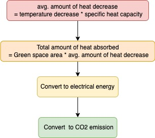
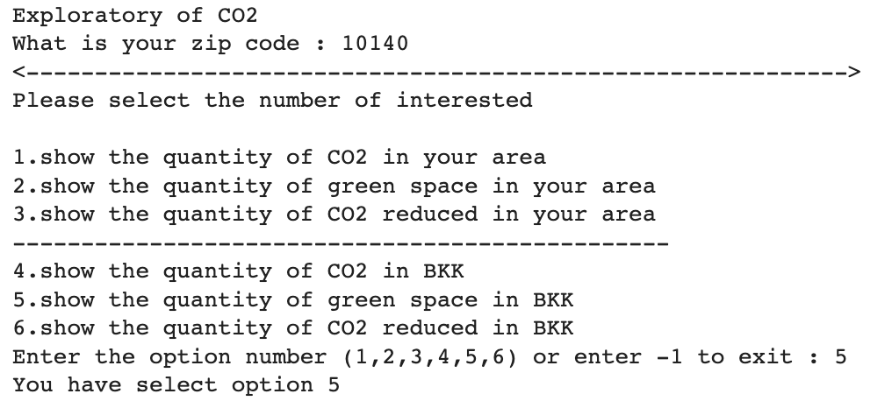

# Exploratory of CO2 in Bangkok
**By Thanapong (billy)**

In this project has identified the situation of CO2 emission in Bangkok. Two things to consider on this project are:
 - **What factor that affects the increasing of CO2 emission?**
 - **Do green spaces in BKK effectively enough to reduced CO2 quantity in bangkok?**
 
The goal of this project is to find the solution to reduce CO2 emission by 2% in 2023.
Therefore, EDA process focusing on things that can help to reduce CO2 in bangkok which is green space in Bangkok by converting the green area into ability to reduce CO2 as following this flowchart.

---
# Dataset
- **section 1**
   - CO2 emission in World
   - Forest area(% land area) in World
- **section 2**
   - CO2 emission per capita in Thailand
   - people in each district in bangkok
   - postal code in each district
   - green space in bangkok
   - BKK map (.shp format)
- **section 3**
   - CO2 emission by the usage sector

---

## Conclusions

s

This project is just breifly analysis with an assumption and limitation about calculating the CO2 reduction capability due to lack of sensing data of air quantity. The result gives that the green space in BKK at present is **not enough to meet the objective**, as you can see the capability of CO2 reduction is only 0.52% of the total CO2 emission in BKK. Therefore, the Chatchart campaign is necessary and it will make a big change to the quantity of CO2 reduction in BKK.

### Non-Financial Benefits
- Raise CO2 awareness among local residents.
- To assess the quality of life in each district (including carbon footprint and green space in each district).

### Financial Benefits
- If there is a carbon tax, this script could be used as an inspection tool.
- Businesses in environmental fields, e.g., electric cars, trees, will have more demand in the carbon-rich area.

## Future work

- Modify the Green BKK map class to getting more informative and easy to understand
